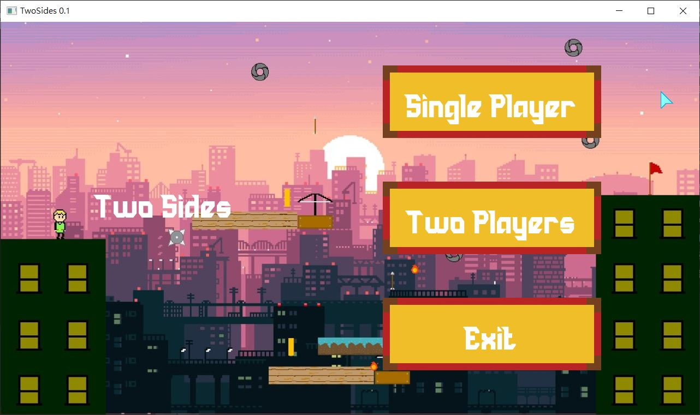
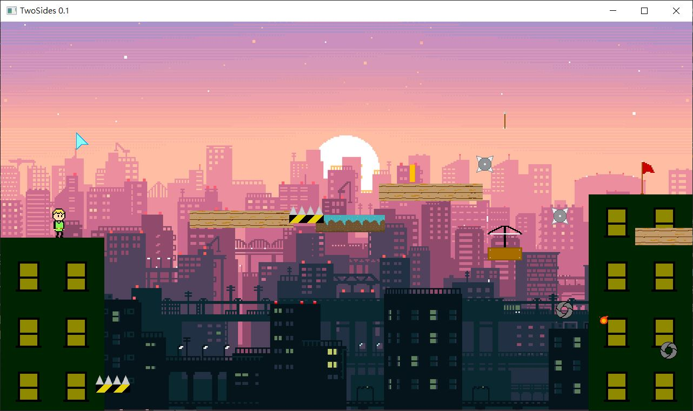
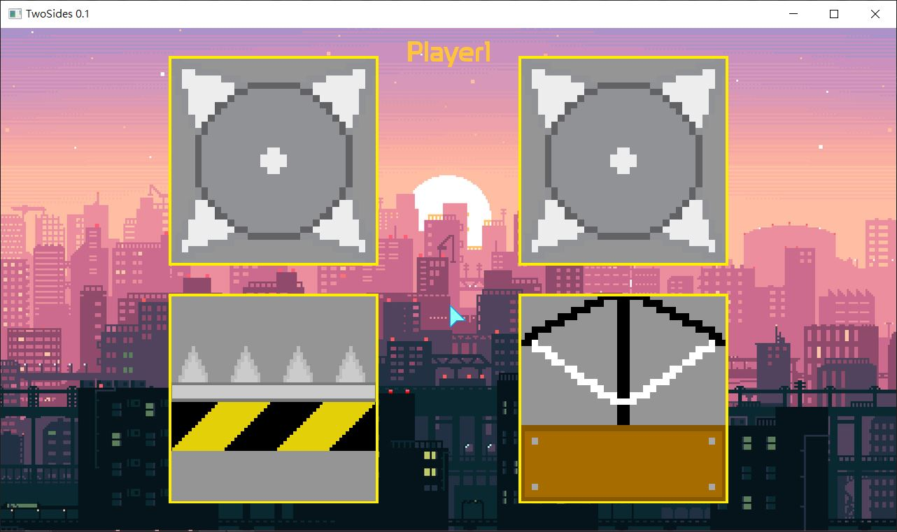

# TwoSides-Allegro5-Mini-Game
A mini game written by C with Allegro5 library

# Prerequisite
Since this game is based on `Allegro5`, You may install `Allegro` from the NuGet package manager in Visual Studio.
You can create a new project and import these files in Visual Studio. You should enable `Image Addon`, `Truetype Font Addon`, `Primitives Addon`, `Audio Addon`,
`Audio Codec Addon`, `Dialog Addon`, `Font Addon`, `Color Addon`, and `Video Addon` in your project's properties.

# Control
* Press `W`, `A`, `S`, `D` to move the character. In two players mode, you can move the second character with arrow keys.
* Press `H` to return home menu.
* Press `M` in home menu to enter debug mode, and press it again in debug mode can show the bounding boxes of objects. (debug mode was not completed)
* Press `P` in the game can let you place object with right mouse click. To switch different type of object, just simply press `P` again.
* Press `L` in the game can let you delete object with right mouse click, you cannot delete the enviromental objects (goal flag, buildings, etc.)

# Gamerule
The goal is to get 10 points, you can get 1 point when you get coin or reach the goal.
In the single player mode, the object will be placed randomly in the map, it will become more difficult after every round;
In the two players mode, each player can choose one object every round and place it to wherever he/she wants.

# Screenshots

